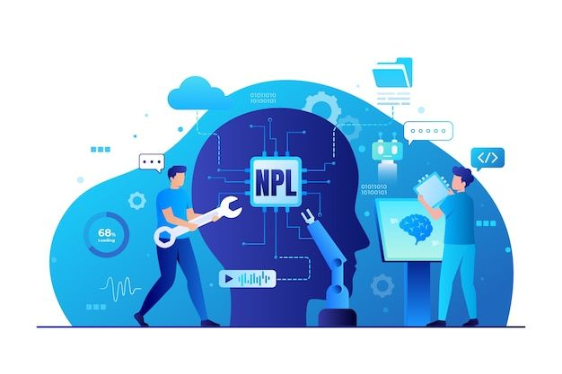
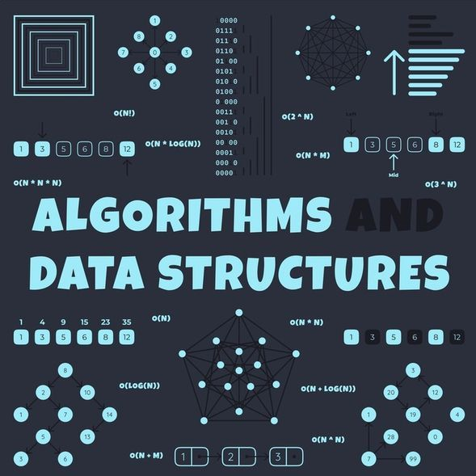
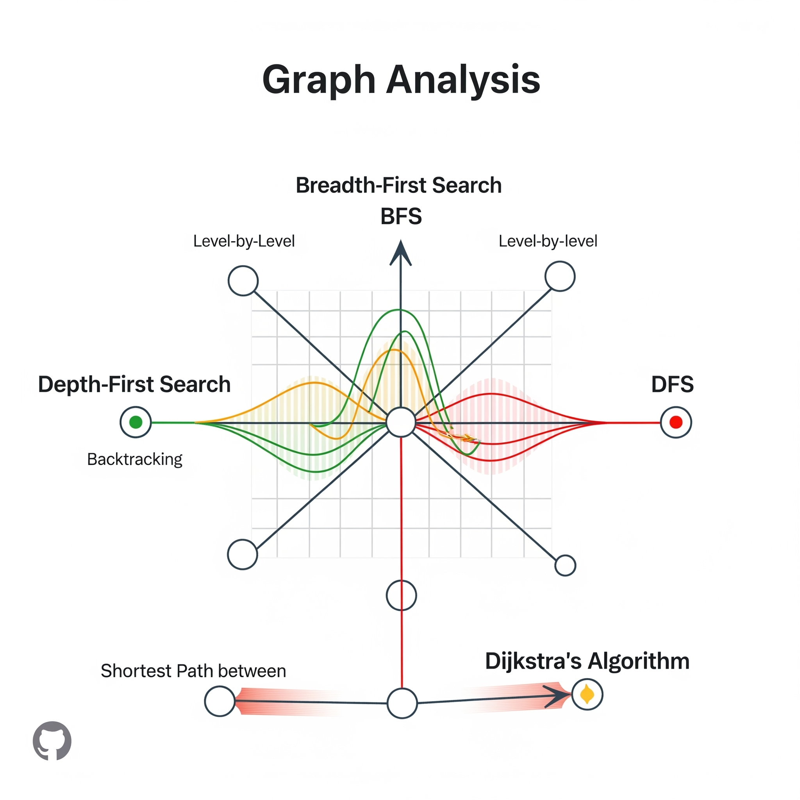

# 👨‍💻 Luiz Antônio Azevedo
## Data Scientist & Machine Learning Engineer

---

## 🛠️ Stack Tecnológico

<div align="center">


</div>

---

## 🎓 Formação & Qualificações

### 📚 **Educação Formal**
- **Ciência da Computação**

### 🚀 **Especialização Avançada**
- **Bootcamp em LLMs e IA Avançada - DataH (Empresa Canadense)**
  - 🤖 Large Language Models e aplicações práticas
  - 🔬 Projetos hands-on com modelos de ponta
  - 📖 Estudos aprofundados de artigos científicos recentes
  - 🌐 Formação internacional especializada exclusivamente em IA

---

## 💼 Experiência Profissional

### 🏢 **Data Scientist | VisianSystems (Londres)**  
> *Análise de dados para finanças e crypto*  
- Desenvolvimento de modelos preditivos para diagnóstico médico e detecção de fraudes financeiras.  
- Implementação de pipelines de dados escaláveis com AWS e Docker.  
- Criação de dashboards interativos no Power BI para monitoramento em tempo real.
  
### 🏥 **Estagiário em Análise de Dados | Unimed**
> *Transformando dados hospitalares em insights estratégicos*

- 📊 Análise avançada de dados hospitalares para otimização da gestão
- 📈 Desenvolvimento de dashboards interativos para tomada de decisão
- 🎯 Implementação de KPIs para monitoramento de performance

### 💼 **Estagiário em Análise de Dados | Adasi**
> *Especialista em Business Intelligence e relatórios gerenciais*

- 📋 Criação de relatórios abrangentes e análises detalhadas
- 🖥️ Desenvolvimento de dashboards em Power BI
- 📊 Automação de processos de análise e reporting

### 👨‍🏫 **Tutor de Programação | CESAR**
> *Mentor em lógica de programação para jovens talentos*

- 🎓 Ensino de fundamentos de programação para estudantes do Ensino Médio
- 👥 Mentoria personalizada e desenvolvimento de talentos
- 🚀 Criação de metodologias de ensino inovadoras

---

## 🚀 Portfólio de Projetos

### ⭐ **Projetos em Destaque**

## ♟️ [Análise de Dados de Xadrez](https://github.com/LuizAz3vedo/ChessProject)

<div align="center">


</div>

**🎯 Objetivo:** Análise de 20.000+ partidas do Lichess com dashboards interativos

**🛠️ Tecnologias:** 


**📊 Resultados:**
- Identificação de padrões de desempenho por faixa de pontuação
- Visualizações interativas para exploração de dados
- Análise de tendências em partidas de xadrez competitivo

---

## 📈 [Painel de BI + K-means](https://github.com/LuizAz3vedo/BI_kmeans)

<div align="center">

</div>

**🎯 Objetivo:** Segmentação inteligente de clientes com Machine Learning

**🛠️ Tecnologias:** 


**🎯 Algoritmo:** K-means Clustering para segmentação

**📊 Resultados:**
- Segmentação eficaz de clientes em grupos distintos
- Dashboard integrado no Power BI
- Insights actionáveis para estratégias de marketing

---

## 🏗️ [Data Warehouse Medallion Architecture](https://github.com/LuizAz3vedo/sql-data-warehouse)

<div align="center">

</div>

**🎯 Objetivo:** Data Warehouse empresarial com arquitetura moderna

**🛠️ Tecnologias:** 


**🏛️ Arquitetura Implementada:**
- **Bronze Layer:** Dados brutos sem transformação
- **Silver Layer:** Dados limpos e padronizados  
- **Gold Layer:** Star Schema otimizado para BI

**📊 Características:**
- Pipelines ETL automatizados
- Modelo dimensional para alta performance
- Integração completa com ferramentas de BI

---

## 💰 [Análise de Performance com Cashback](https://github.com/LuizAz3vedo/Painel_Analise_Cashback)

**🎯 Objetivo:** Otimização de estratégias de cashback através de análise de dados

**🛠️ Ferramentas:** Python (Pandas, Matplotlib, Seaborn), Power BI, Excel

**📊 Principais Resultados:**
- **ROI do Grupo 1:** 17.338% (melhor performance)
- **Recomendação estratégica:** Cashback entre 416% e 577%
- **Insights:** Balanceamento entre ROI e volume de vendas

---

## 🚀 [Big Data com DuckDB](https://github.com/LuizAz3vedo/bigdata-duckdb)

<div align="center">

</div>

**🎯 Objetivo:** Processamento de 1 bilhão de registros meteorológicos

**🛠️ Tecnologias:** 


**⚡ Performance Highlights:**
- Análise de grandes volumes sem carregamento em memória
- Consultas otimizadas diretamente em arquivos CSV
- Geração e processamento eficiente de dados sintéticos

---

## 🤖 [Estudos em Inteligência Artificial](https://github.com/LuizAz3vedo/AI-Study)

<div align="center">

</div>

**🎯 Objetivo:** Implementação prática de algoritmos de ML e Deep Learning

**🛠️ Tecnologias:** 


**🧠 Modelos Implementados:**
- Árvores de Decisão | Regressão Linear/Logística | Regressão Polinomial
- K-means Clustering | Naive Bayes | Redes Neurais

---

## 📊 [NLP - Análise de Tweets sobre Desastres](https://github.com/LuizAz3vedo/NPL-Twitter)

<div align="center">

</div>

**🎯 Objetivo:** Classificação de tweets relacionados a desastres usando NLP

**🛠️ Técnicas Aplicadas:**
- **Pré-processamento:** Limpeza, tokenização, remoção de stopwords
- **Modelos:** LinearSVC, Logistic Regression, Naive Bayes
- **Avaliação:** F1-score, AUC-ROC, Matriz de Confusão

**📈 Resultados:** Classificação precisa entre tweets de desastres reais vs. não-relacionados

---

## 📈 [Análise de Criptomoedas](https://github.com/LuizAz3vedo/crypto-analysis)

<div align="center">

</div>

**🎯 Objetivo:** Análise temporal avançada do Bitcoin (BTC/USD)

**🛠️ Modelos Utilizados:**
- **Séries Temporais:** SARIMA, GARCH, Prophet
- **Clustering:** K-Means para comportamentos similares
- **Detecção de Anomalias:** Isolation Forest

**📊 Principais Insights:**
- Maior volatilidade identificada nos finais de semana
- 3 clusters comportamentais distintos
- 39 anomalias detectadas, incluindo eventos extremos de mercado

---

## 🧠 [Algoritmos e Estruturas de Dados](https://github.com/LuizAz3vedo/Estrutura-de-Dados)

<div align="center">

</div>

**📖 Base Teórica:** "Entendendo Algoritmos: Um Guia Ilustrado"

**🛠️ Implementações:**
- **Algoritmos de Busca:** Linear, Binária
- **Algoritmos de Grafos:** Dijkstra, BFS, DFS
- **Técnicas Avançadas:** Programação Dinâmica, Algoritmos Gulosos

---

## 📊 [Análise de Grafos](https://github.com/LuizAz3vedo/graphs)

<div align="center">

</div>

**🎯 Objetivo:** Implementação de algoritmos clássicos de teoria dos grafos

**🔍 Algoritmos Implementados:**
- **Busca em Largura (BFS)** - Exploração por níveis
- **Busca em Profundidade (DFS)** - Exploração em profundidade  
- **Dijkstra** - Algoritmo de caminho mínimo

---

## 🎯 Competências Técnicas

| **Área** | **Tecnologias** | **Nível** |
|----------|-----------------|-----------|
| **🐍 Linguagens** | Python, SQL, R | ████████░ 80% |
| **🤖 Machine Learning** | Scikit-learn, TensorFlow, PyTorch | ████████░ 85% |
| **📊 Data Analysis** | Pandas, NumPy, Matplotlib, Seaborn | █████████ 90% |
| **💼 Business Intelligence** | Power BI, Tableau, SSIS | ████████░ 85% |
| **🏗️ Data Engineering** | SQL Server, PostgreSQL, DuckDB | ███████░░ 75% |
| **☁️ Cloud & Big Data** | AWS, Docker, Spark | ██████░░░ 60% |

---

## 🏆 Metodologia de Trabalho

### 📈 **Data Science Lifecycle**

```
📊 Data Collection → 🔍 Exploratory Analysis → 🧹 Data Cleaning 
    ↓
⚙️ Feature Engineering → 🤖 Model Training → 📊 Evaluation 
    ↓  
🚀 Deployment → 📈 Monitoring → 🔄 Iteration
```

### 🎯 **Abordagem Estratégica**
- **Business First:** Sempre alinhar projetos com objetivos de negócio
- **Data-Driven:** Decisões baseadas em evidências e análises rigorosas
- **Iterativo:** Melhoria contínua através de feedback e testes
- **Escalável:** Soluções pensadas para crescimento e produção

---

## 🌟 Diferenciais Competitivos

### 🎯 **Visão de Negócio**
Traduzir problemas complexos de negócio em soluções técnicas viáveis e escaláveis

### 🔄 **Aprendizado Contínuo** 
Sempre atualizado com as últimas tendências em IA, participando do bootcamp DataH (empresa canadense)

### 🤝 **Comunicação Eficaz**
Capacidade de apresentar insights técnicos de forma clara para stakeholders não-técnicos

### ⚡ **Foco em Performance**
Otimização constante de código e algoritmos para máxima eficiência e escalabilidade

---

## 📞 Entre em Contato

<div align="center">

### 🚀 **Pronto para transformar dados em valor?**

Estou sempre em busca de desafios que permitam aplicar ciência de dados e machine learning para resolver problemas reais e gerar impacto significativo nos negócios.

**📧 Email:** luizazevedo3212@hotmail.com  
**💼 LinkedIn:** [Luiz Antônio Azevedo](https://www.linkedin.com/in/luiz-antônio-azevedo-34b38b23a/)  
**📄 Currículo:** [Download PDF](https://drive.google.com/file/d/1hlYLiwZtI-WANvG2UJHR35TIB0Jp6FNS/view?usp=sharing)

---


### ✨ *"Dados são o novo petróleo, mas insights são o combustível da inovação"* ✨

</div>
