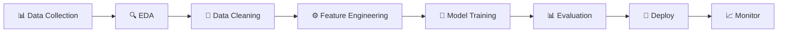

# 👨‍💻 Luiz Antônio Azevedo
## Data Scientist & Machine Learning Engineer

  

  <h3>🚀 Transformando Dados em Insights Estratégicos</h3>
  
Especialista em Machine Learning, Business Intelligence e Analytics

  
  
  
  
  

---

## 🛠️ Stack Tecnológico

  
**Linguagens & Ferramentas**
  

**Bibliotecas & Frameworks**

---

## 🎓 Formação & Qualificações

<table>
<tr>
<td width="50%">

### 📚 **Educação Formal**
- **Ciência da Computação**
  - Sólida base teórica em algoritmos e estruturas de dados
  - Foco em desenvolvimento de software e sistemas

</td>
<td width="50%">

### 🚀 **Especialização**
- **Bootcamp em LLMs e IA Avançada - DataH**
  - Large Language Models e aplicações práticas
  - Projetos hands-on com modelos de ponta
  - Estudos de artigos científicos recentes

</td>
</tr>
</table>

---

## 💼 Trajetória Profissional

### 🏥 **Estagiário em Análise de Dados | Unimed**
> *Transformando dados hospitalares em insights estratégicos*
- 📊 Análise avançada de dados hospitalares para otimização da gestão
- 📈 Desenvolvimento de dashboards interativos para tomada de decisão
- 🎯 Implementação de KPIs para monitoramento de performance

### 💼 **Estagiário em Análise de Dados | Adasi**
> *Especialista em Business Intelligence e relatórios gerenciais*
- 📋 Criação de relatórios abrangentes e análises detalhadas
- 🖥️ Desenvolvimento de dashboards em Power BI
- 📊 Automação de processos de análise e reporting

### 👨‍🏫 **Tutor de Programação | CESAR**
> *Mentor em lógica de programação para jovens talentos*
- 🎓 Ensino de fundamentos de programação
- 👥 Mentoria para estudantes do Ensino Médio
- 🚀 Desenvolvimento de metodologias de ensino inovadoras

---

## 🚀 Portfólio de Projetos

### 🎯 **Projetos em Destaque**

#### ♟️ [Análise de Dados de Xadrez](https://github.com/LuizAz3vedo/ChessProject)

**20.000+ partidas do Lichess analisadas**

🛠️ **Tech Stack:** Python, Pandas, Dash, NumPy  
📊 **Foco:** Análise de performance, visualizações interativas, padrões de jogo

✨ *Dashboard interativo revelando insights sobre estratégias vencedoras*

#### 📈 [BI + Machine Learning](https://github.com/LuizAz3vedo/BI_kmeans)

**Segmentação inteligente de clientes**

🛠️ **Tech Stack:** Python, Scikit-learn, Power BI  
🎯 **Algoritmo:** K-means Clustering  

✨ *Integração perfeita entre ML e Business Intelligence*

#### 🏗️ [Data Warehouse Medallion](https://github.com/LuizAz3vedo/sql-data-warehouse)

**Arquitetura moderna Bronze-Silver-Gold**

🛠️ **Tech Stack:** SQL Server, SSIS, Power BI  
🏛️ **Arquitetura:** Star Schema, ETL Pipelines  

✨ *Data Warehouse empresarial com padrões de mercado*

### 🔬 **Projetos de Machine Learning & IA**

<strong>🤖 Projetos de Inteligência Artificial</strong>

#### 🧠 [Estudos em IA](https://github.com/LuizAz3vedo/AI-Study)
- **Modelos Implementados:** Decision Trees, Linear/Logistic Regression, K-means, Naive Bayes
- **Frameworks:** TensorFlow, PyTorch, Scikit-learn
- **Foco:** Implementação prática de algoritmos fundamentais

#### 📊 [NLP - Análise de Tweets](https://github.com/LuizAz3vedo/NPL-Twitter)
- **Objetivo:** Classificação de tweets relacionados a desastres
- **Técnicas:** Pré-processamento de texto, tokenização, feature engineering
- **Modelos:** LinearSVC, Logistic Regression, Naive Bayes

<strong>💰 Projetos de Análise Financeira</strong>

#### 📈 [Análise de Criptomoedas](https://github.com/LuizAz3vedo/crypto-analysis)
- **Dados:** Bitcoin (BTC/USD) - análise temporal avançada
- **Modelos:** SARIMA, GARCH, Prophet
- **Insights:** Padrões sazonais, detecção de anomalias, clusters comportamentais

#### 💳 [Análise de Cashback](https://github.com/LuizAz3vedo/Painel_Analise_Cashback)
- **Case:** Otimização de estratégias de cashback
- **ROI:** Grupo 1 apresentou 17.338% de retorno
- **Recomendação:** Cashback entre 416% e 577%

<strong>⚡ Projetos de Big Data & Performance</strong>

#### 🚀 [Big Data com DuckDB](https://github.com/LuizAz3vedo/bigdata-duckdb)
- **Escala:** 1 bilhão de registros processados
- **Performance:** Consultas otimizadas sem carregamento em memória
- **Aplicação:** Análise de dados meteorológicos sintéticos

#### 🔄 [Algoritmos e Estruturas](https://github.com/LuizAz3vedo/Estrutura-de-Dados)
- **Algoritmos:** Dijkstra, BFS/DFS, Programação Dinâmica
- **Base Teórica:** "Entendendo Algoritmos: Um Guia Ilustrado"
- **Implementações:** Grafos, árvores, algoritmos gulosos

---

## 📊 Estatísticas GitHub

---

## 🎯 Expertise & Competências

<table>
<tr>
<td width="33%">

### 🔍 **Data Analysis**
- Análise exploratória de dados
- Visualização avançada
- Estatística descritiva e inferencial
- KPIs e métricas de negócio

</td>
<td width="33%">

### 🤖 **Machine Learning**
- Algoritmos supervisionados/não-supervisionados
- Deep Learning (TensorFlow, PyTorch)
- NLP e análise de texto
- Séries temporais e forecasting

</td>
<td width="33%">

### 🏢 **Business Intelligence**
- Data Warehousing
- ETL/ELT pipelines
- Dashboards interativos
- Arquitetura Medallion

</td>
</tr>
</table>

---

## 📈 Metodologias & Frameworks

**Data Science Lifecycle**

---

## 🌟 Diferenciais Competitivos

<h3>🎯</h3>
<strong>Foco em Resultados</strong>

Projetos sempre alinhados com objetivos de negócio

<h3>🔄</h3>
<strong>Aprendizado Contínuo</strong>

Sempre atualizado com as últimas tendências em IA

<h3>🤝</h3>
<strong>Comunicação Clara</strong>

Traduzindo insights técnicos para stakeholders

<h3>⚡</h3>
<strong>Eficiência</strong>

Soluções otimizadas e escaláveis

---

## 📞 Vamos Conversar?

### 🚀 **Pronto para o próximo desafio?**

Estou sempre em busca de oportunidades para aplicar data science e machine learning em problemas reais e impactantes.

**📧 Email:** [luizazevedo3212@hotmail.com](mailto:luizazevedo3212@hotmail.com)  
**💼 LinkedIn:** [Luiz Antônio Azevedo](https://www.linkedin.com/in/luiz-antônio-azevedo-34b38b23a/)  
**📄 Currículo:** [Download PDF](https://drive.google.com/file/d/1hlYLiwZtI-WANvG2UJHR35TIB0Jp6FNS/view?usp=sharing)

---

  
  
  

    ✨ "Dados são o novo petróleo, mas insights são o combustível da inovação" ✨
  

