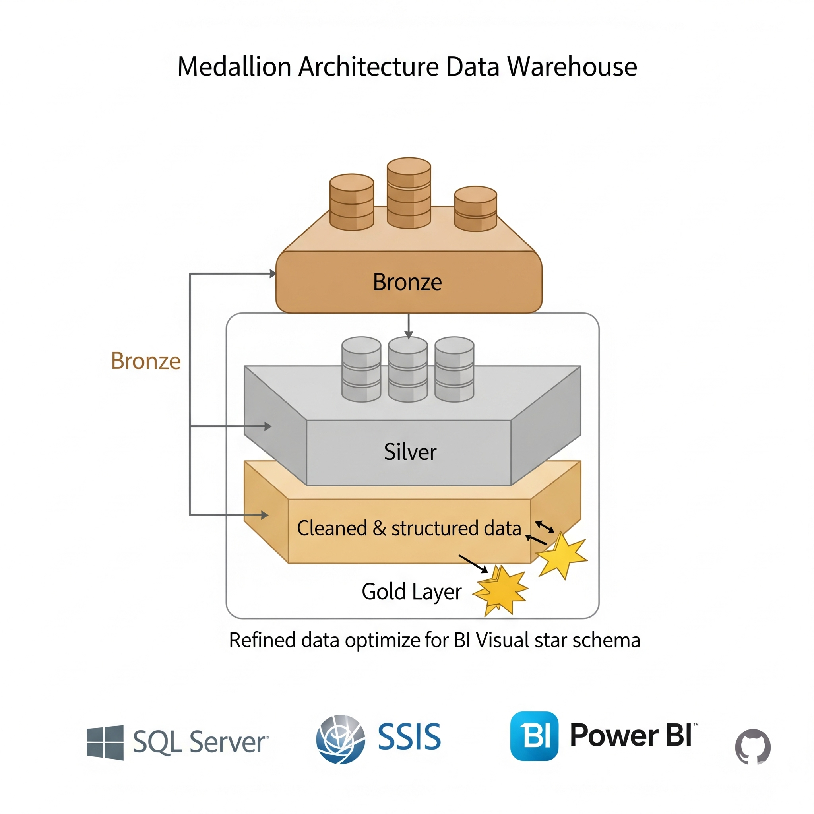
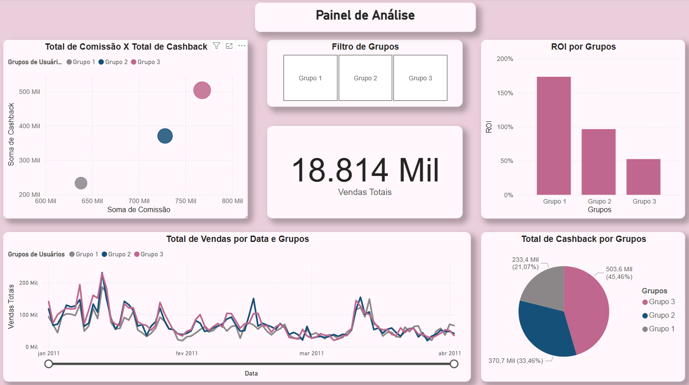
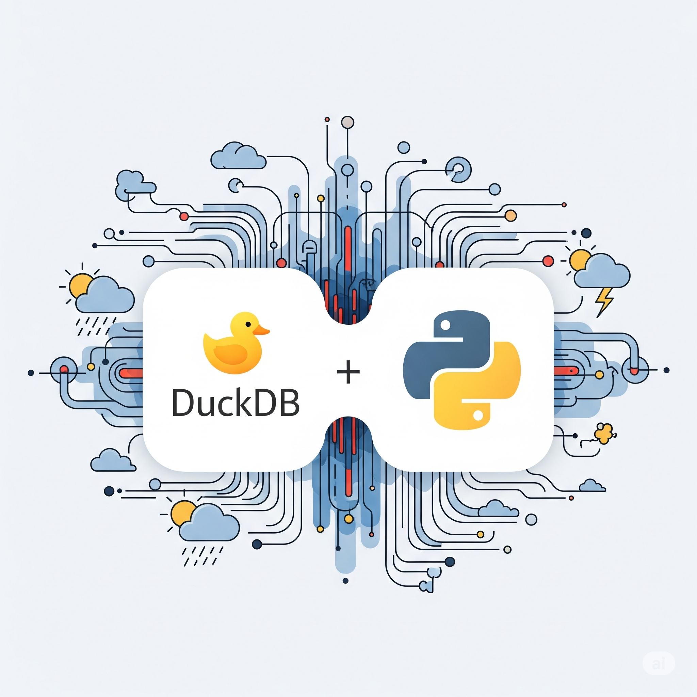
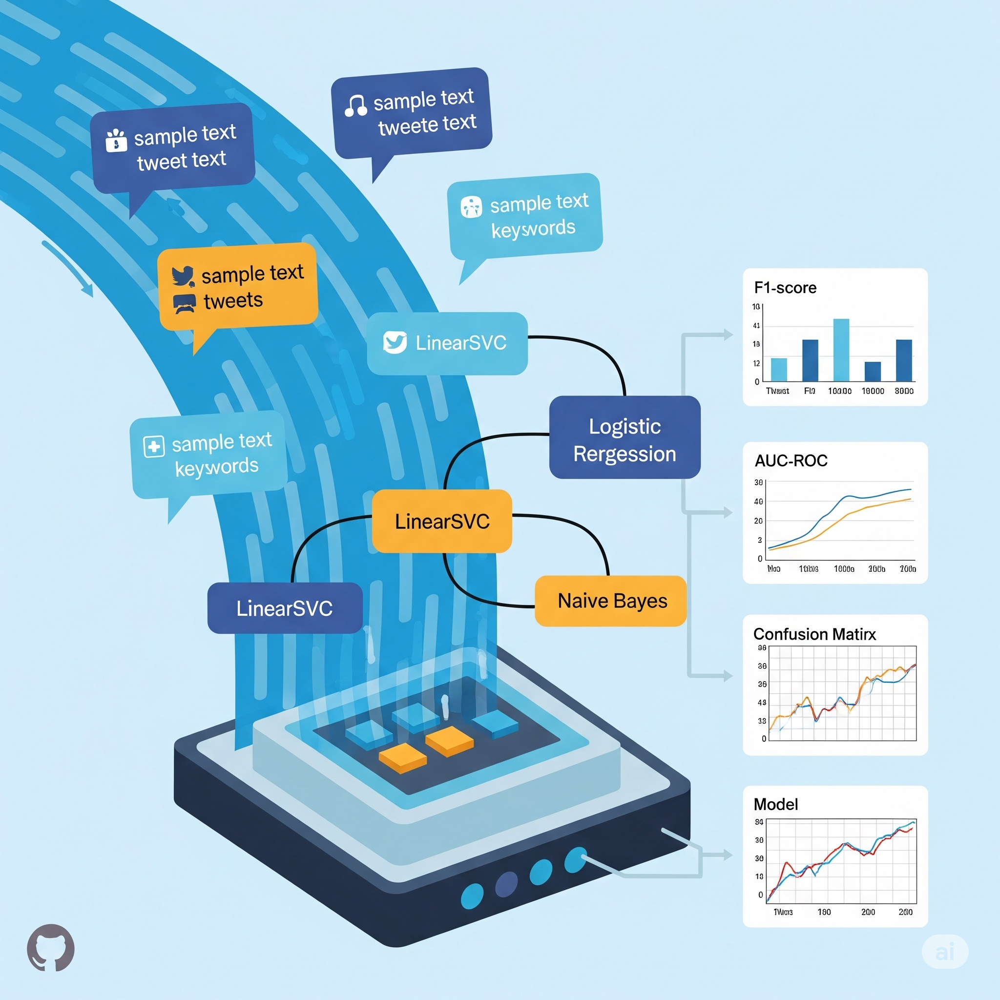
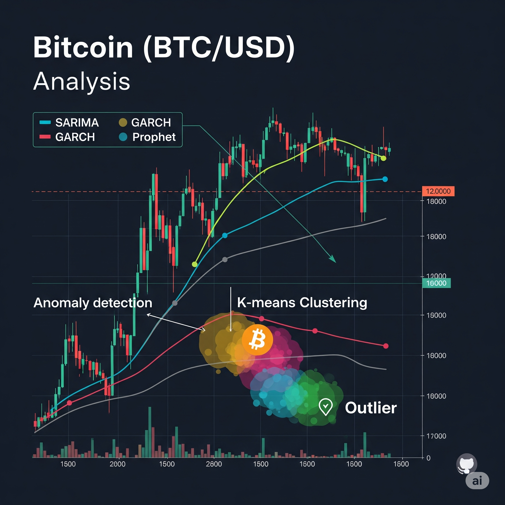
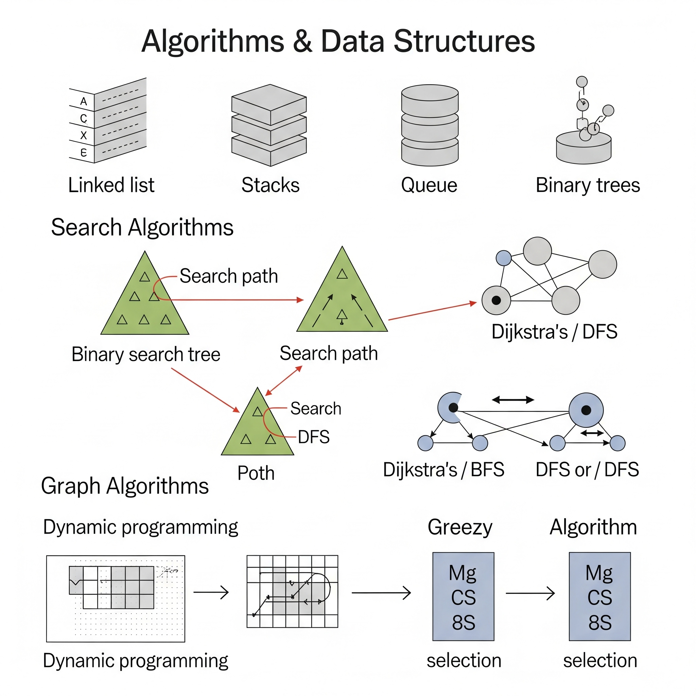
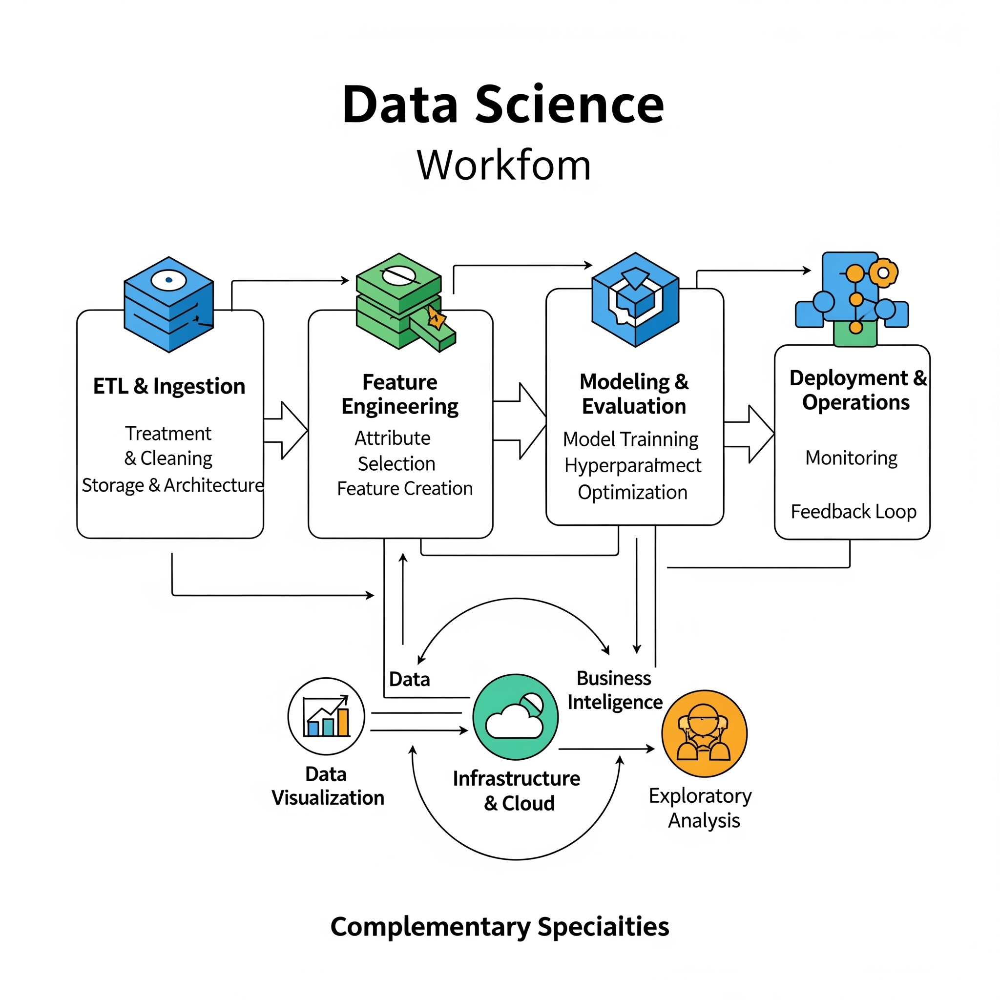

<!-- ========================= -->
<!-- 👨‍💻 Luiz Antônio Azevedo -->
<!-- ========================= -->
<div class="profile-header">
  <p align="center">
    <h1 align="center">Luiz Antônio Azevedo</h1>
    <p align="center"><strong>AI Engineer & Data Scientist</strong></p>
    <p align="center">
      <a href="#-stack-tecnológico">🛠 Stack</a> •
      <a href="#-formação--qualificações">🎓 Formação</a> •
      <a href="#-experiência-profissional">💼 Experiência</a> •
      <a href="#-pesquisa--colaborações">🔬 Pesquisa</a> •
      <a href="#-portfólio-de-projetos">🚀 Portfólio</a> •
      <a href="#-competências-técnicas">🎯 Competências</a> •
      <a href="#-contato">📞 Contato</a>
    </p>
  </p>
</div>

---
  
## 🛠 Stack Tecnológico

  <p align="center" class="stack-images">
    <!-- Linguagens e Ferramentas Principais -->
    
    
    
    
    <br><br>
    <!-- Bibliotecas de Data Science / ML -->
    
    
    
    
    
    <br><br>
    <!-- Cloud & Infra -->
    
    
    
  </p>

---

## 🎓 Formação & Qualificações

### 📚 Educação Formal
- **Bacharelado em Ciência da Computação** – Unifavip Wyden (2022-2025)

### 🚀 Especialização Avançada
- **Bootcamp em LLMs e IA Avançada** (DataH – empresa canadense)  
  - 🤖 Estudo aprofundado de Large Language Models e aplicações práticas  
  - 🔬 Projetos hands-on com modelos de ponta (GPT, BERT, etc.)  
  - 📖 Análise de artigos científicos recentes em IA  
  - 🌐 Visão internacional focada em IA de última geração

### 📜 Certificações
- Bootcamp Data Science Santander
- Bootcamp Ciência de Dados com Python Santander
- CyberSecurity Essentials – Cisco Academy
- Fundamentos de Python para Análise de Dados e Data Science
- Microsoft Power BI para Business Intelligence e Data Science
- Finalista Desafio Jovem Empreendedor Sebrae

---

## 💼 Experiência Profissional

---

### 🤖 AI Engineer & Data Scientist | NOTORIA
<sub>*Junho 2025 – Atualmente*</sub>  
> **Liderança em Projetos de IA End-to-End**  
- Liderança no ciclo de vida completo de projetos de IA, da concepção à implementação em produção.
- Arquitetura e desenvolvimento de modelos complexos de Machine Learning e Deep Learning para solucionar desafios de negócio.
- Construção e otimização de pipelines de dados robustos e escaláveis para garantir a qualidade e o fluxo de informações.
- Desenvolvimento e implantação de agentes LLM sofisticados para automação de tarefas e interações inteligentes.

---

### 🏢 Data Scientist Jr. | VisianSystems (Londres)
<sub>*Abril 2025 – Junho 2025*</sub>  
> **Projeto de Crypto & ETL End-to-End**  
- Responsável por todo o processo de ETL: coleta de dados de APIs e exchanges, tratamento/limpeza, integração e carregamento em banco de dados.  
- Gerenciei a arquitetura de dados garantindo escalabilidade e alta disponibilidade.  
- Desenvolvi features customizadas para análise de tendências em criptomoedas (volatilidade, padrões de candles, sazonalidade).  
- Criei e otimizei algoritmos de detecção de tendências e sinais de trading utilizando técnicas de Machine Learning.

---

### 👨‍🏫 Tutor de Programação | CESAR Institute  
<sub>*Outubro 2024 – Março 2025*</sub>  
> **Mentoria em Lógica de Programação para Jovens Talentos**  
- Lecionei fundamentos de lógica de programação (Python, Javascript, Python para Dados) para alunos do Ensino Médio.  
- Elaborei material didático e exercícios práticos para fixação de conceitos.  
- Acompanhei o progresso individual dos estudantes, proporcionando mentoria personalizada.

---

### 💼 Estagiário em Business Intelligence | Adasi Software
<sub>*Fevereiro 2024 – Agosto 2024*</sub>  
> **Business Intelligence & Relatórios Gerenciais**  
- Criei relatórios detalhados e análises de indicadores de performance para clientes.  
- Desenvolvi dashboards interativos em Power BI, reduzindo em 40% o tempo de elaboração de relatórios.  
- Automatizei processos de extração e consolidação de dados usando scripts Python.  

---

### 🏥 Estagiário em Análise de Dados | Unimed  
<sub>*Setembro 2023 – Janeiro 2024*</sub>  
> **Transformando dados hospitalares em insights estratégicos**  
- Realizei análises avançadas de dados clínicos para otimizar processos internos.  
- Desenvolvi dashboards dinâmicos, facilitando tomadas de decisão.
  
---

## 🔬 Pesquisa & Colaborações

### dotLAB Brazil  
- **Membro do Grupo de Pesquisa**  
- Foco em aplicar técnicas de Machine Learning e Deep Learning para aprimorar a tomada de decisões e otimizar processos, redes e serviços.
- Condução de estudos colaborativos, workshops internos e experimentos com redes neurais e modelos generativos.

---

## 🗂️ Portfólio de Projetos

### 🧠 Personal Knowledge Base (RAG System)
- **Link:** [Repositório](https://github.com/LuizAz3vedo/personal-knowledge-base)  
- **Objetivo:** Sistema RAG pessoal para consultar notas do Obsidian, PDFs e bookmarks usando LLMs locais via Ollama.  
- **Tecnologias:**  
    
    
    
    
    
- **Arquitetura:**  
  ```
  Pergunta → Retriever (busca semântica) → ChromaDB → Re-Ranker → LLM (Ollama) → Resposta + Citações
  ```
- **Destaques:**  
  - 📄 **Múltiplos formatos:** Markdown/Obsidian, PDF, URLs e bookmarks  
  - 🔍 **Busca semântica** com embeddings `nomic-embed-text`  
  - 🎯 **Re-ranking opcional** com Cross-Encoder para maior precisão  
  - 📊 **Duas interfaces:** CLI interativa e Web (Streamlit)  
  - 🔒 **100% local:** Nenhuma API externa, privacidade total

---

### ♟️ Análise de Dados de Xadrez
- **Link:** [Repositório](https://github.com/LuizAz3vedo/ChessProject)  
- **Objetivo:** Análise de 20.000+ partidas do Lichess para identificar padrões de performance por faixa de rating.  
- **Tecnologias:**  
    
    
    
    
- **Imagens:**  
  <div align="center" class="project-images chess-gallery">
    
    
    
  </div>

---

### 📊 Painel de BI + K-means
- **Link:** [Repositório](https://github.com/LuizAz3vedo/BI_kmeans)  
- **Objetivo:** Utilizar o algoritmo **K-means** para construir um modelo de Machine Learning para segmentação de clientes e, em seguida, integrar esses resultados a um dashboard no **Power BI**
- **Tecnologias:**  
    
    
    
- **Imagens:**  
  <div align="center" class="project-images">
    
  </div>

---

### 🏗️ Data Warehouse (Medallion Architecture)
- **Link:** [Repositório](https://github.com/LuizAz3vedo/sql-data-warehouse)  
- **Objetivo:** Data Warehouse empresarial com camadas Bronze, Silver e Gold.  
- **Tecnologias:**  
    
    
    
- **Arquitetura:**  
  - **Bronze Layer:** Dados brutos sem transformação  
  - **Silver Layer:** Dados limpos e padronizados  
  - **Gold Layer:** Star Schema otimizado para BI  
- **Imagens:**  
  <div align="center" class="project-images">
    
  </div>

---

### 💰 Painel de Análise de Cashback
- **Link:** [Repositório](https://github.com/LuizAz3vedo/Painel_Analise_Cashback)  
- **Objetivo:** Otimização de estratégias de cashback através de análise de ROI e volume de vendas.  
- **Tecnologias:** Python (Pandas, Matplotlib, Seaborn), Power BI, Excel  
- **Principais Resultados:**  
  - **ROI do Grupo 1:** 17.338% (melhor performance)  
  - **Recomendação estratégica:** Cashback entre 416% e 577%  
  - **Insights:** Balanceamento entre ROI e volume de vendas
- **Imagens:**  
  <div align="center" class="project-images">
    
  </div>

---

### 🚀 Big Data com DuckDB
- **Link:** [Repositório](https://github.com/LuizAz3vedo/bigdata-duckdb)  
- **Objetivo:** Processamento de 1 bilhão de registros meteorológicos com DuckDB sem carregar tudo em memória.  
- **Tecnologias:**  
    
    
- **Destaques de Performance:**  
  - Análise de grandes volumes sem carga em memória  
  - Consultas otimizadas diretamente em arquivos CSV  
  - Geração e processamento eficiente de dados sintéticos  
- **Imagens:**  
  <div align="center" class="project-images">
    
  </div>

---

### 🤖 Estudos em Inteligência Artificial
- **Link:** [Repositório](https://github.com/LuizAz3vedo/AI-Study)  
- **Objetivo:** Implementação prática de algoritmos de Machine Learning & Deep Learning.  
- **Tecnologias:**  
    
    
    
- **Modelos Implementados:**  
  - Árvores de Decisão, Regressão Linear/Logística, Regressão Polinomial e Múltipla 
  - K-means Clustering, Naive Bayes, Redes Neurais  
- **Imagens:**  
  <div align="center" class="project-images">
    
  </div>

---

### 📊 NLP – Análise de Tweets sobre Desastres
- **Link:** [Repositório](https://github.com/LuizAz3vedo/NPL-Twitter)  
- **Objetivo:** Classificação de tweets relacionados a desastres usando técnicas de NLP e modelos de ML.  
- **Técnicas Aplicadas:**  
  - **Pré-processamento:** Limpeza, tokenização, remoção de stopwords  
  - **Modelos:** LinearSVC, Logistic Regression, Naive Bayes  
  - **Avaliação:** F1-score, AUC-ROC, Matriz de Confusão  
- **Imagens:**  
  <div align="center" class="project-images">
    
  </div>

---

### 📈 Análise de Criptomoedas (Bitcoin)
- **Link:** [Repositório](https://github.com/LuizAz3vedo/crypto-analysis)  
- **Objetivo:** Análise temporal avançada do Bitcoin (BTC/USD) usando séries temporais, clustering e detecção de anomalias.  
- **Modelos Utilizados:**  
  - **Séries Temporais:** SARIMA, GARCH, Prophet  
  - **Clustering:** K-means para identificar comportamentos similares  
  - **Detecção de Anomalias:** Isolation Forest  
- **Principais Insights:**  
  - Maior volatilidade identificada nos finais de semana  
  - 3 clusters comportamentais distintos  
  - 39 anomalias detectadas, incluindo eventos extremos de mercado  
- **Imagens:**  
  <div align="center" class="project-images">
    
  </div>

---

### 🧠 Algoritmos e Estruturas de Dados
- **Link:** [Repositório](https://github.com/LuizAz3vedo/Estrutura-de-Dados)  
- **Objetivo:** Implementações didáticas de algoritmos de busca, grafos, programação dinâmica e algoritmos gulosos.  
- **Implementações Principais:**
  - **Estruturas de Dados**: Implementações de listas, pilhas, filas, árvores
  - **Busca:** Linear, Binária  
  - **Grafos:** Dijkstra, BFS, DFS  
  - **Técnicas Avançadas:** Programação Dinâmica, Algoritmos Gulosos  
- **Imagens:**  
  <div align="center" class="project-images">
    
  </div>

---

### 📊 Análise de Grafos
- **Link:** [Repositório](https://github.com/LuizAz3vedo/graphs)  
- **Objetivo:** Exploração de algoritmos clássicos em grafos: BFS, DFS e Dijkstra.  
- **Algoritmos Implementados:**  
  - **Busca em Largura (BFS)** – Exploração por níveis  
  - **Busca em Profundidade (DFS)** – Exploração em profundidade  
  - **Dijkstra** – Algoritmo de caminho mínimo  
- **Imagens:**  
  <div align="center" class="project-images">
    
  </div>

---

## 🎯 Competências Técnicas

| **Área**                 | **Tecnologias**                                        | **Nível**       |
|--------------------------|--------------------------------------------------------|-----------------|
| **🖥️ Linguagens**        | Python, SQL, PySpark                                   | Avançado        |
| **🤖 Machine Learning**   | Scikit-learn, TensorFlow, PyTorch, XGBoost             | Avançado        |
| **🧠 NLP & LLMs**         | LangChain, Embeddings, RAG, Agentes LLM                | Avançado        |
| **📊 Data Analysis**     | Pandas, NumPy, Matplotlib, Seaborn                      | Avançado        |
| **💼 BI & Reporting**    | Power BI, Tableau                                      | Avançado        |
| **🏗️ Data Engineering**  | SQL Server, PostgreSQL, DuckDB, Spark, Databricks      | Avançado        |
| **☁️ Cloud & Big Data**  | GCP (BigQuery, Vertex AI), AWS, Docker                 | Intermediário   |

---

## 🗺 Mapa de Data Science

<summary>Mapa de Data Science</summary>

  <div align="center" class="project-images">
      
  </div>


🌟 Diferenciais Competitivos

**Visão de Negócio**
Habilidade de traduzir problemas complexos em soluções técnicas viáveis e escaláveis.

**Experiência Internacional**
Atuação em empresa londrina (VisianSystems) e formação em bootcamp canadense (DataH).

**Liderança em IA**
Ciclo de vida completo de projetos de IA, da concepção à produção, incluindo agentes LLM.

**Aprendizado Contínuo**
Atualização constante em IA, LLMs e técnicas de ponta em Machine Learning.

**Comunicação Eficaz**
Capacidade comprovada de apresentar insights técnicos de forma clara para stakeholders.

---

## 📞 Contato

<p align="center"> <strong>Pronto para transformar dados em valor?</strong><br><br> </p> 

- 📧 <a href="mailto:luizazevedo3212@hotmail.com">luizazevedo3212@hotmail.com</a><br> 
- 📱 (81) 99900-9029<br>
- 💼 <a href="https://www.linkedin.com/in/luiz-antônio-azevedo-34b38b23a/" target="_blank">LinkedIn</a><br> 
- 🐙 <a href="https://github.com/LuizAz3vedo" target="_blank">GitHub</a><br>
- 📄 <a href="https://drive.google.com/file/d/1hlYLiwZtI-WANvG2UJHR35TIB0Jp6FNS/view?usp=sharing" target="_blank">Currículo (PDF)</a> 

<p align="center"> ✨ <em>"Machine Learning, human thinking."</em> ✨ </p>
